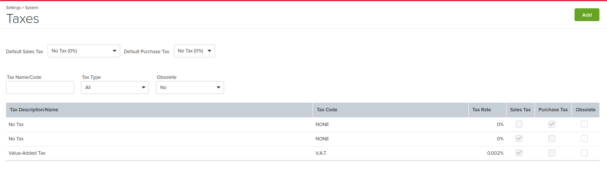
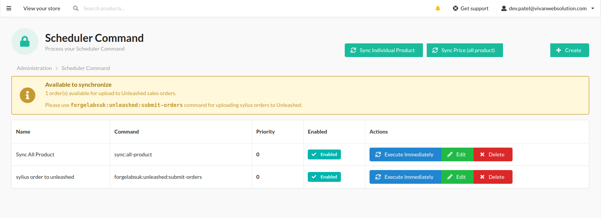
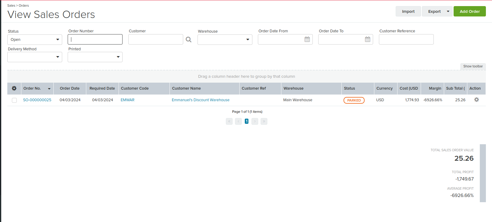

<p align="center">
    <a href="https://sylius.com" target="_blank">
        
    </a>
</p>

<h1 align="center">SyliusUnleashedOrdersPlugin</h1>

## Quickstart Installation

### Traditional

1. Run the following command to install the plugin via Composer:

    ```bash
    composer require forgelabsuk/sylius-unleashed-orders-plugin
    ```

2. Add the Sylius application's routing by creating the file `config/routes/unleashed_orders_plugin.yaml` with the following content:

   ```yaml
   forge_labs_uk_unleashed_orders_shop:
       resource: "@ForgeLabsUkSyliusUnleashedOrdersPlugin/Resources/config/shop_routing.yml"
       prefix: /{_locale}
       requirements:
           _locale: ^[a-z]{2}(?:_[A-Z]{2})?$

   forge_labs_uk_sylius_unleashed_orders_admin:
       resource: "@ForgeLabsUkSyliusUnleashedOrdersPlugin/Resources/config/admin_routing.yml"
       prefix: /%sylius_admin.path_name%


3. Update the code in `src/Entity/Order/Orders.php` (if this file already exists in your Sylius application):

    ```php
    <?php

    declare(strict_types=1);
    
    namespace App\Entity\Order;
    
    use Doctrine\ORM\Mapping as ORM;
    use Sylius\Component\Core\Model\Order as BaseOrder;
    use ForgeLabsUk\SyliusUnleashedOrdersPlugin\Trait\OrderTrait;
    
    /**
     * @ORM\Entity
     * @ORM\Table(name="sylius_order")
     */
    #[ORM\Entity]
    #[ORM\Table(name: 'sylius_order')]
    class Order extends BaseOrder
    {
        use OrderTrait;
    }

    ```

   Ensure you add the `use ForgeLabsUk\SyliusUnleashedOrdersPlugin\Trait\OrderTrait;` statement to import the trait and use it inside the `Product` class.

4. Update the code in `config/packages/_sylius.yaml` (if this file already exists in your Sylius application):

   Add or modify the following configuration under `sylius_order`:

    ```yaml
    sylius_order:
        resources:
            order:
                classes:
                    model: App\Entity\Order\Order
                    controller: ForgeLabsUk\SyliusUnleashedOrdersPlugin\Controller\OrderController
    ```

   Ensure to replace `ForgeLabsUk\SyliusUnleashedOrdersPlugin\Controller\OrderController` with the correct namespace of your order controller.


5. Execute the Doctrine migrations diff to create a migration file:

    ```bash
    php bin/console doctrine:migrations:diff
    ```

6. Execute the Doctrine migrations to set up the database:

    ```bash
    php bin/console doctrine:migrations:migrate
    ```

# Adding Tax Rate of 0.002% in Unleashed Software

This guide outlines the steps to add a tax rate of 0.002% in Unleashed software.

## Prerequisites

Before proceeding, ensure you have access to your Unleashed account with appropriate permissions to configure taxes.

## Steps

1. **Login to Unleashed Software**: Open your web browser and navigate to the Unleashed login page. Log in using your credentials.

2. **Navigate to Tax Settings**:
    - Once logged in, navigate to the tax settings section. This is usually found in the settings or configuration menu, depending on your user interface.

3. **Add New Tax Code**:
    - In the tax settings, look for an option to add a new tax code. This is where you'll define the tax code and rate.
    - Click on the "Add Tax Code" or similar button to create a new tax code.

4. **Enter Tax Details**:
    - In the form that appears, enter the following details:
        - **Tax Code**: Enter the tax code, e.g., V.A.T.
        - **Tax Rate**: Enter the tax rate as 0.002%. Some systems may require you to enter this as a decimal, which would be 0.002.

5. **Save Changes**:
    - After entering the tax details, save the changes. This will add the new tax code with the specified rate to your Unleashed settings.

6. **Verify Configuration**:
    - Once saved, verify that the tax code and rate are correctly added. You can do this by checking the list of tax codes or performing a test transaction with the tax applied.

7. **Complete**:
    - You have successfully added a tax rate of 0.002% in Unleashed software. You can now use this tax code in your transactions.

## Additional Notes

- If you encounter any issues or have questions, refer to the Unleashed documentation or contact their support team for assistance.
- Ensure that the tax rate is correctly configured and applied to your transactions to avoid any discrepancies in reporting or invoicing.

## Screenshot




## Plugin Functionality




